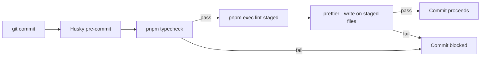

### 1.5 Git Hooks

Git hooks are managed by [Husky](https://github.com/typicode/husky) and run automatically on specific Git events to enforce code quality before changes enter the repository.

#### 1.5.1 Toolchain

| Tool        | Role                                                |
| ----------- | --------------------------------------------------- |
| Husky       | Git hook manager — triggers scripts on Git events   |
| lint-staged | Runs tasks on **staged files only** (not full repo) |
| Prettier    | Code formatter — auto-fixes style on commit         |

#### 1.5.2 Pre-commit Hook

The pre-commit hook (`.husky/pre-commit`) performs two checks sequentially:

1. **Type check** — `pnpm typecheck` (runs `tsc --noEmit`)
2. **Format staged files** — `pnpm exec lint-staged` (triggers Prettier on staged files)

If either step fails, the commit is blocked.



#### 1.5.3 Configuration

**Husky** — hook scripts in `.husky/` directory, installed via `pnpm prepare` (which runs `husky`).

**lint-staged** — configured in `package.json`:

```json
"lint-staged": {
  "**/*": "prettier --write --ignore-unknown"
}
```

This runs Prettier on **every staged file** regardless of type; `--ignore-unknown` ensures only files Prettier knows how to format are processed.

#### 1.5.4 Developer Workflow

- **Normal commit** — just `git commit` as usual; formatting and type checking happen automatically.
- **Skipping hooks** — `git commit --no-verify` (use sparingly; only when the hook itself is broken).
- **Manual format** — `pnpm format` runs Prettier on the entire project (not just staged files).

#### 1.5.5 Adding New Hooks

When adding a new Git hook (e.g., commit message validation):

1. Install the tool (e.g., `commitlint`) as a dev dependency.
2. Add the hook script to `.husky/` (e.g., `.husky/commit-msg`).
3. Update `lint-staged` config in `package.json` if the tool runs on staged files.
4. Update §1.5.2 and §1.5.3 above to document the new hook.
