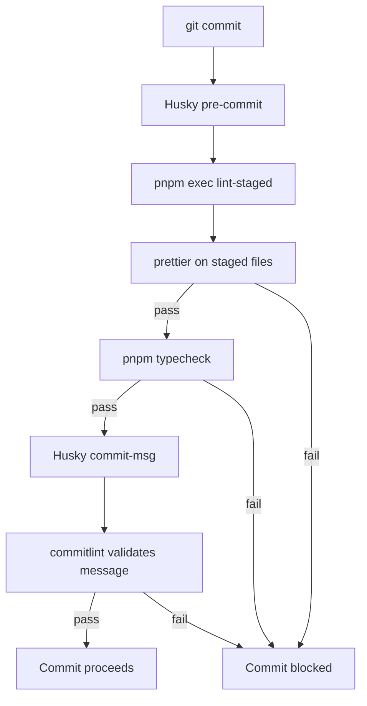

### 1.5 Git Hooks

Git hooks are managed by [Husky](https://github.com/typicode/husky) and run automatically on specific Git events to enforce code quality before changes enter the repository.

#### 1.5.1 Toolchain

| Tool        | Role                                                |
| ----------- | --------------------------------------------------- |
| Husky       | Git hook manager - triggers scripts on Git events   |
| lint-staged | Runs tasks on **staged files only** (not full repo) |
| Prettier    | Code formatter - auto-fixes style on commit         |

#### 1.5.2 Hooks

##### 1.5.2.1 pre-commit

The pre-commit hook (`.husky/pre-commit`) performs two checks sequentially:

1. **Format staged files** — `pnpm exec lint-staged` (triggers Prettier on staged files)
2. **Type check** — `pnpm typecheck` (always runs on the full project via `tsc --noEmit`)

If either step fails, the commit is blocked.

> Type check runs on the **full project**, not just staged files.
> This is intentional — `tsc --noEmit` loads `tsconfig.json` and
> requires the entire project to compile. Limiting to staged files
> (via lint-staged glob) causes `TS5112` errors.

##### 1.5.2.2 commit-msg

The commit-msg hook (`.husky/commit-msg`) validates commit messages against
[Conventional Commits](https://www.conventionalcommits.org/) format:

```
type(scope?): description

feat: add noscript content generation
fix: external link icons not added on initial load
docs: update instruction files for Phase 7
chore: optimize Git hooks config
```

Configuration is in `commitlint.config.js` (extends `@commitlint/config-conventional`).

##### 1.5.2.3 pre-push

The pre-push hook (`.husky/pre-push`) runs `pnpm build` to verify the
project bundles successfully before pushing to remote. This catches
Vite-specific errors (broken dynamic imports, missing CSS references)
that `tsc --noEmit` cannot detect.

##### 1.5.2.4 Flow Diagram



#### 1.5.3 Configuration

**Husky** - hook scripts in `.husky/` directory, installed via `pnpm prepare` (which runs `husky`).

**commitlint** - configured in `commitlint.config.js`:

```js
export default {
  extends: ["@commitlint/config-conventional"],
};
```

**lint-staged** - configured in `package.json`:

```json
"lint-staged": {
  "**/*": ["prettier --write --ignore-unknown"]
}
```

- Array format (`[...]`) ensures lint-staged re-adds files modified by Prettier via `git add`.
- `--ignore-unknown` ensures only file types Prettier supports are processed.

**pre-push** - `.husky/pre-push` runs `pnpm build` to verify bundling before pushing.

#### 1.5.4 Developer Workflow

- **Normal commit** — just `git commit` as usual; formatting, type checking, and message validation happen automatically.
- **Skipping hooks** — `git commit --no-verify` (use sparingly; only when the hook itself is broken).
- **Manual format** — `pnpm format` runs Prettier on the entire project (not just staged files).

#### 1.5.5 Adding New Hooks

When adding a new Git hook:

1. Install the tool as a dev dependency.
2. Add the hook script to `.husky/` (e.g., `.husky/commit-msg`).
3. Update `lint-staged` config in `package.json` if the tool runs on staged files.
4. Update §1.5.2 and §1.5.3 above to document the new hook.
